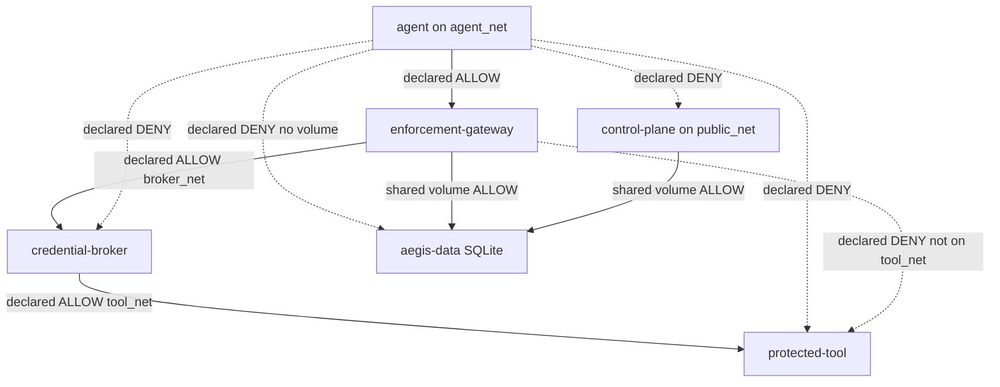

# PHASE 13.A — EXECUTION BOUNDARY ATTACK MATRIX

Baseline: `439cd54f4058838e0aeba6dcd25ef5414c754499`
Phase 12.D — Trajectory + Contract Enforcement + EAT Binding

Method: ATTACK → OBSERVE → CLASSIFY → DOCUMENT
No architecture rewrite. No silent remediation.

Conclusion of this phase:

**Execution Boundary: NOT VERIFIED at L3/runtime level.**

HTTP 403 / 401 from application roles is APPLICATION_BLOCK, not proof that a compromised Agent cannot reach Broker, Tool, DB, or Control Plane.

---

## 1. Environment examined

| Fact | Observed |
| --- | --- |
| Workspace | `/workspace` |
| Git HEAD | `439cd54` (clean) |
| Docker CLI | absent (`docker` / `docker-compose` not found) |
| `/var/run/docker.sock` | absent |
| TCP 2375 / 2376 | connection refused |
| Compose stack | not running |
| Host `127.0.0.1:8000` / `:8001` | connection refused |
| Docker DNS names (`enforcement-gateway`, `credential-broker`, `protected-tool`, `control-plane`) | NXDOMAIN / gaierror |
| Process context of this exam | host-like Linux, uid 0, full capabilities — **not** the Agent container namespace |
| Tests executed | pytest from host Python, TestClient in-process |

Therefore live path `Agent container → Broker/Tool/DB/CP` could not be executed. YAML and in-process HTTP are not a substitute.

---

## 2. Architecture actually observed

Services in `docker-compose.yml`:

| Service | Role (`AEGIS_ROLE`) | Image | User | Privileged |
| --- | --- | --- | --- | --- |
| `control-plane` | control-plane | `backend/Dockerfile` | default (root in image) | unset |
| `enforcement-gateway` | enforcement-gateway | `backend/Dockerfile` | default (root in image) | unset |
| `credential-broker` | credential-broker | `backend/Dockerfile` | default (root in image) | unset |
| `protected-tool` | protected-tool | `backend/Dockerfile` | default (root in image) | unset |
| `agent` | n/a (probe) | `infra/agent/Dockerfile` | `10001:10001` | `false` |

Internal HTTP URLs (Compose env):

| From | URL |
| --- | --- |
| Agent | `AEGIS_BASE_URL=http://enforcement-gateway:8000` |
| Gateway | `AEGIS_BROKER_URL=http://credential-broker:8000/api` |
| Broker | `AEGIS_TOOL_URL=http://protected-tool:8000/api` |
| Gateway DB | `sqlite:////data/aegis.db` |
| Control Plane DB | `sqlite:////data/aegis.db` (same volume) |

Role split in `backend/app/main.py`:

- control-plane: auth, agents, policies, resources, approvals, behavior
- enforcement-gateway: `/api/authorize`, `/api/gateway`
- credential-broker: `/api/internal/broker/execute`
- protected-tool: `/api/internal/tools/{tool}/{operation}`
- monolith `all`: control + enforcement; **does not** mount broker/tool routers

Application controls if a caller can talk HTTP to a process:

- Broker: `X-Internal-Token` must equal `AEGIS_INTERNAL_GATEWAY_TOKEN` (401 otherwise)
- Tool: `X-Internal-Token` must equal `AEGIS_INTERNAL_TOOL_TOKEN` (401 otherwise)
- Control plane: agent token on non-enforcement `/api/*` → **403**
- Tool secret: CRM rejects wrong `AEGIS_CRM_SECRET`

Those are APPLICATION_BLOCK. They assume the client already has a TCP path.

---

## 3. Network topology actually observed

Declared Compose networks:

| Network | driver | internal | Purpose |
| --- | --- | --- | --- |
| `agent_net` | bridge | **false** | Agent ↔ Gateway |
| `broker_net` | bridge | true | Gateway ↔ Broker |
| `tool_net` | bridge | true | Broker ↔ Tool |
| `public_net` | bridge | false | Host ↔ Control Plane |

Attachments:

```
agent                 → agent_net
enforcement-gateway   → agent_net, broker_net
credential-broker     → broker_net, tool_net
protected-tool        → tool_net
control-plane         → public_net
```

Published ports:

| Service | ports |
| --- | --- |
| control-plane | `8000:8000` (all host interfaces, not 127.0.0.1) |
| enforcement-gateway | `8001:8000` (all host interfaces) |
| broker / tool / agent | none |

Volumes:

| Volume | Mounted on |
| --- | --- |
| `aegis-data` `/data` | control-plane, enforcement-gateway |
| none | agent, broker, tool |

`internal: true` on broker_net/tool_net blocks egress to Internet from those bridges. It does **not** isolate two containers on the same bridge. Isolation between Agent and Broker is supposed to come from **not sharing a network**, which is a Compose contract, not a live probe in this environment.



---

## 4. Attack Matrix

Classification legend:

- APPLICATION_BLOCK: HTTP/auth/policy rejected the call. **Security boundary proven: NO**
- NETWORK_BLOCK: TCP/DNS failed from the real Agent namespace. Not observed here.
- PROCESS/CONTAINER_BLOCK: Compose/image/user/caps declare isolation. Runtime not probed.
- NOT_VERIFIED: environment cannot prove the path.
- VULNERABLE: confirmed bypass. **None confirmed** (no live Agent namespace).

| Source | Destination | Expected | Observed | Classification | Evidence | Status |
| --- | --- | --- | --- | --- | --- | --- |
| Agent | Gateway | ALLOW | Compose: shared `agent_net`; role exposes `/api/authorize` and `/api/gateway`; L3 not probed | NOT_VERIFIED | `docker-compose.yml` agent/gateway networks; `create_app("enforcement-gateway")` | DECLARED |
| Agent | Broker | DENY | No shared network in YAML; in-process POST `/api/internal/broker/execute` without `X-Internal-Token` → 401; L3 not probed | NOT_VERIFIED (app: APPLICATION_BLOCK) | Compose attachments; `test_agent_to_broker_is_application_block_not_network` | DECLARED |
| Agent | Tool | DENY | No shared network; in-process POST `/api/internal/tools/crm/read` → 401; L3 not probed | NOT_VERIFIED (app: APPLICATION_BLOCK) | Compose; tool router | DECLARED |
| Agent | DB | DENY | Agent has no `aegis-data` mount; runtime filesystem not probed | NOT_VERIFIED (declared PROCESS/CONTAINER_BLOCK) | Compose volumes | DECLARED |
| Agent | Control Plane | DENY | No shared network; agent token on `/api/agents` → 403; CP role omits authorize/gateway/broker; L3 not probed | NOT_VERIFIED (app: APPLICATION_BLOCK) | `main.py` middleware; role routers | DECLARED |
| Gateway | Broker | ALLOW | Shared `broker_net`; `AEGIS_BROKER_URL` set; L3 not probed | NOT_VERIFIED | Compose env | DECLARED |
| Gateway | Tool | DENY | Gateway not on `tool_net`; no `AEGIS_TOOL_URL`; L3 not probed | NOT_VERIFIED (declared PROCESS/CONTAINER_BLOCK) | Compose | DECLARED |
| Broker | Tool | ALLOW | Shared `tool_net`; `AEGIS_TOOL_URL` set; L3 not probed | NOT_VERIFIED | Compose env | DECLARED |
| Agent | sensitive volume | DENY | No volumes on agent service; runtime not probed | NOT_VERIFIED | Compose `volumes: []` | DECLARED |
| Agent | Docker socket | DENY | No `docker.sock` in Compose; host exam has no socket; Agent namespace not probed | NOT_VERIFIED | Compose text; host `ls` | DECLARED |
| Agent | host network | DENY | `network_mode: host` absent; runtime not probed | NOT_VERIFIED | Compose | DECLARED |
| Agent | Docker DNS internal hosts | DENY | Agent env contains broker/tool/CP hostnames; DNS isolation not probed | NOT_VERIFIED | Agent environment block | FINDING (info) |
| Agent | host-published ports | DENY | CP `8000:8000` and GW `8001:8000` unbound to localhost; hairpin from Agent to host not probed | NOT_VERIFIED | Compose `ports` | FINDING |

No row is NETWORK_BLOCK. No row is proven.

---

## 5. Side-channel findings

Checked against Compose YAML and host exam. Runtime inside `aegis-agent` **not** observed.

| Check | Compose / image | This host | Agent runtime |
| --- | --- | --- | --- |
| Docker socket mount | not present | socket absent | NOT_VERIFIED |
| `network_mode: host` | absent | n/a | NOT_VERIFIED |
| `privileged: true` | agent `false`; others unset | n/a | NOT_VERIFIED |
| `cap_add` | absent (agent `cap_drop: ALL`) | n/a | NOT_VERIFIED |
| `security_opt` | agent `no-new-privileges:true` | n/a | NOT_VERIFIED |
| Agent `read_only` | true + tmpfs `/tmp` | n/a | NOT_VERIFIED |
| Shared volumes | agent none; CP+GW share `aegis-data` | n/a | NOT_VERIFIED |
| Host mounts | none declared | n/a | NOT_VERIFIED |
| `extra_hosts` | none | n/a | NOT_VERIFIED |
| Agent secrets in env | no CRM/EAT/internal/DB keys | n/a | NOT_VERIFIED |
| Agent hostname env | `AEGIS_BROKER_HOST`, `AEGIS_TOOL_HOST`, `AEGIS_CONTROL_HOST` set | n/a | FINDING |
| Published ports | 8000 and 8001 on all interfaces | closed here | FINDING / NOT_VERIFIED |
| Backend image USER | none (root) for CP/GW/Broker/Tool | n/a | residual |
| `/proc` `/sys` in Agent | not restricted in Compose | this exam is host, unrestricted | NOT_VERIFIED |

Default Compose secrets (dev fallbacks) live on Gateway/Broker/Tool/CP, not Agent: `AEGIS_SECRET_KEY`, `AEGIS_EAT_KEY`, `AEGIS_INTERNAL_*`, `AEGIS_CRM_SECRET`. Compromise of Gateway or Broker yields those values. Out of scope for Agent L3, in scope for process isolation of the control layer.

---

## 6. Security findings

### F-13A-01 — L3/runtime execution boundary not verified

- Severity: High (assurance gap, not a confirmed bypass)
- Attack: Compromised Agent reaches Broker/Tool/CP/DB by TCP, Docker DNS, or host port hairpin
- Prerequisite: Running Compose stack and a shell in `aegis-agent`
- Observed behavior: Docker daemon absent; no Agent namespace; no live connect
- Why this matters: Phase 13 exists to distinguish 403 from unreachable. That distinction was not measured
- Current control: Compose network attachments and `internal: true` on broker/tool nets
- Residual risk: Unknown. Contract may be correct and still unproven
- Recommended remediation: Phase 13.B live probes from `docker compose exec agent python probe.py`

### F-13A-02 — Host-published Control Plane and Gateway ports

- Severity: Medium (config residual; bypass **possible**, not proven)
- Attack: Agent → default gateway / host IP → `host:8000` (Control Plane) or `host:8001` (Gateway)
- Prerequisite: Agent container can route to host-published ports (common on Docker bridges). `agent_net` is not `internal`
- Observed behavior: YAML publishes `8000:8000` and `8001:8000` without `127.0.0.1`. Live hairpin not executed
- Why this matters: Agent→CP DENY on overlay networks does not bind if the host port is reachable. 403 on CP is still only APPLICATION_BLOCK
- Current control: CP middleware rejects agent tokens with 403; CP role omits enforcement/broker routes
- Residual risk: Agent may still read health, fingerprint the CP, or use stolen human JWT against CP APIs
- Recommended remediation: Bind `127.0.0.1:8000` / `127.0.0.1:8001` or drop host publish; keep Agent on overlay DNS only. Config change, not a new product feature

### F-13A-03 — Shared SQLite volume between Control Plane and Gateway

- Severity: Medium (already declared in Phase 10 README)
- Attack: Compromised Gateway process reads/writes the same `/data/aegis.db` as Control Plane
- Prerequisite: Code exec in Gateway container
- Observed behavior: both services `aegis-data:/data` and `AEGIS_DATABASE_URL=sqlite:////data/aegis.db`
- Why this matters: Gateway→DB is ALLOW in the frozen matrix. That is not Agent→DB. It weakens CP/Gateway privilege split
- Current control: Agent has no volume; Broker/Tool have no volume
- Residual risk: Gateway compromise = full DB
- Recommended remediation: Phase 13.B+ PostgreSQL roles or split stores. Architectural, not a silent Compose tweak without design review

### F-13A-04 — Agent environment names isolated hostnames

- Severity: Low
- Attack: Compromised Agent uses `AEGIS_BROKER_HOST` / `AEGIS_TOOL_HOST` / `AEGIS_CONTROL_HOST` as recon
- Prerequisite: Agent compromise
- Observed behavior: those env vars are set in Compose
- Why this matters: does not open TCP by itself; helps a bypass attempt if DNS or host ports leak
- Current control: intended for `infra/agent/probe.py`
- Residual risk: reconnaissance
- Recommended remediation: keep probe targets only in test/probe image args, not always-on Agent env

### F-13A-05 — `agent_net` is not internal

- Severity: Low/Medium (depends on whether Agent must reach Internet/LLM)
- Attack: Agent egress to Internet or to host-published ports
- Prerequisite: running Agent container
- Observed behavior: `agent_net.internal: false`
- Why this matters: `internal: true` is used on broker/tool nets; Agent can still leave its bridge
- Current control: none at L3 for Agent egress
- Residual risk: data exfil and host-port hairpin (see F-13A-02)
- Recommended remediation: if Agent must only talk to Gateway, set `internal: true` on `agent_net` or add explicit egress policy. Design decision (LLM/tooling needs)

### F-13A-06 — 401/403 on Broker/Tool/CP is not a network deny

- Severity: Info (classification, not a new bug)
- Attack: Analyst treats `HTTP 403` as execution boundary
- Prerequisite: none
- Observed behavior: in-process TestClient 401/403 while sharing the pytest process
- Why this matters: TestClient never leaves the Python process. It cannot prove Docker isolation
- Current control: `test_phase10_isolation.py` already skips L3 without daemon
- Residual risk: false sense of security
- Recommended remediation: keep classifications in 13.A tests; never upgrade NOT_VERIFIED to PASS

No finding was remediated in this phase.

---

## 7. What is PROVEN

Proven in this environment:

- Compose YAML matches `app.network_policy` MATRIX (shared-network reachability as a **declaration**)
- Agent service is declared unprivileged: uid 10001, `cap_drop ALL`, `read_only`, `no-new-privileges`, no docker.sock, no host net, no cap_add
- Agent image does not copy `backend/app` and cannot import `app.protected.crm` from its layout
- Agent Compose env does not contain CRM/EAT/internal/DB secrets
- Broker and Tool publish no host ports
- Broker/Tool routers are absent from monolith `AEGIS_ROLE=all`
- Broker execute without internal token → 401 (application)
- Tool invoke without internal token → 401 (application)
- Control plane with agent token → 403 (application)
- Gateway role does not include tool/broker/control routers
- Existing application suite baseline: see section 10 / pytest

Not proven: any NETWORK_BLOCK.

---

## 8. What is NOT PROVEN

- Agent container cannot open TCP to `credential-broker:8000`
- Agent container cannot open TCP to `protected-tool:8000`
- Agent container cannot open TCP to `control-plane:8000`
- Agent cannot reach host `:8000` / `:8001`
- Docker DNS on `agent_net` does not resolve Broker/Tool/CP
- `internal: true` actually drops packets in this runtime
- iptables/nft between compose bridges
- Agent cannot read `/data/aegis.db`
- Agent cannot open docker.sock (only that Compose does not mount it)
- Gateway cannot TCP to Tool
- Broker can TCP to Tool
- Agent→Gateway TCP ALLOW at L3
- Kernel/namespace isolation of the Agent cgroup

---

## 9. What requires Docker/runtime verification

Run on a host with Docker, without changing product code first:

```
docker compose up --build -d
docker compose exec agent python probe.py
```

Then from the Agent container, explicitly:

- TCP+HTTP to `enforcement-gateway:8000` — expect ALLOW
- TCP to `credential-broker:8000` — expect fail (network unreachable / name error), **not** HTTP 401
- TCP to `protected-tool:8000` — expect fail, not HTTP 401
- TCP to `control-plane:8000` — expect fail, not HTTP 403
- TCP to host default-gateway `:8000` and `:8001`
- `ls /var/run/docker.sock`
- `mount` / volume list for `/data`
- `/proc/1/cgroup`, CapEff, read-only root
- DNS lookup of broker/tool/cp names

If any DENY path returns HTTP 401/403, classify APPLICATION_BLOCK and treat L3 as failed for that path.

---

## 10. Recommended fixes for Phase 13.B

Do not apply in 13.A. Review as config vs architecture:

1. Live Agent-namespace probe job (required for any NETWORK_BLOCK claim)
2. Bind published ports to loopback, or remove CP host publish if dashboard has another path
3. Decide Agent Internet: `agent_net.internal: true` vs required LLM egress
4. Remove always-on `AEGIS_BROKER_HOST` / `AEGIS_TOOL_HOST` / `AEGIS_CONTROL_HOST` from Agent env; pass only to probe
5. Do not split SQLite in 13.B without a store design — track F-13A-03 as known debt
6. Non-root USER on backend images (process hardening, not Agent L3)
7. Keep tests that refuse to call 403 a network deny

---

## Regression

Command:

```
cd backend && python3 -m pytest -q
```

Result: 293 passed, 3 skipped, 0 failed.

Skipped tests are Docker L3 probes (`test_phase10_isolation.py` and Phase 13.A runtime probes). Classification: ENVIRONMENT LIMITATION, not CODE REGRESSION, not SECURITY FINDING-as-PASS.

Existing tests were not rewritten to pass. New tests in `backend/tests/test_phase13a_execution_boundary.py` encode the matrix and skip L3 without Docker.

---

## Checkpoint policy

This phase produced tests and documentation only. Findings F-13A-02, F-13A-03, F-13A-05 need config/architecture decisions.

No automatic commit while those remain open by design of Phase 13.A.

Execution Boundary is **not** declared SECURE.
